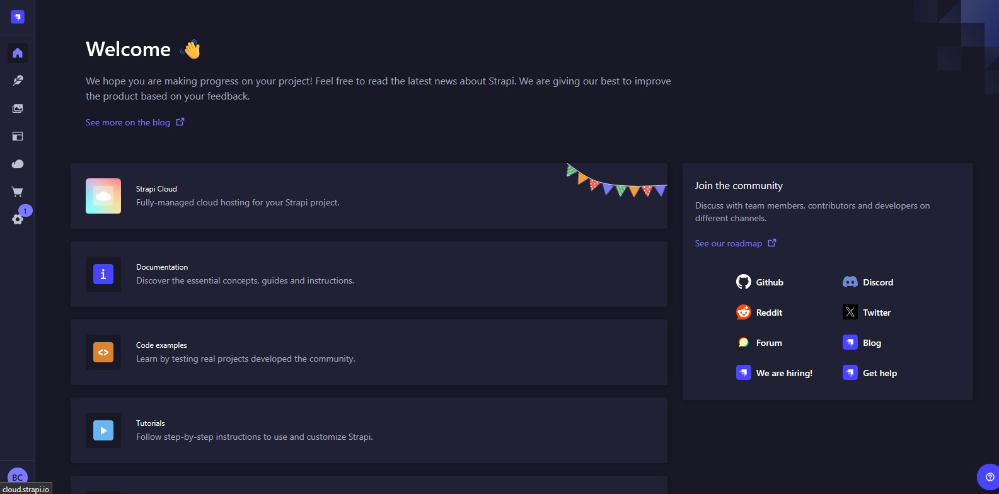

# 🛬 Strapi Landing Pages

O backend do projeto Landing Pages foi desenvolvido com Strapi, um poderoso e flexível CMS headless baseado em Node.js. Ele atua como o fornecedor de dados dinâmicos para o front-end em React, permitindo o gerenciamento completo das landing pages sem a necessidade de alterar o código do front-end.

### ⚙️ Principais responsabilidades:

* Gerenciamento de Conteúdo: Criação e edição de páginas, seções e componentes das landing pages, utilizando a interface amigável do Strapi.
* API RESTful: Disponibilização de uma API que o front-end consome para renderizar as páginas de forma dinâmica.
* Autenticação e Permissões: Controle de acesso seguro para administradores e editores de conteúdo.
* Extensibilidade: Suporte à personalização e adição de novos tipos de conteúdo conforme as necessidades do projeto.

### 🛠️ Tecnologias Utilizadas

* [Strapi](https://strapi.io/)
* [PostgreSQL](https://www.postgresql.org/)
* [Cloudinary](https://cloudinary.com/)

## 📄 Dependências e Versões Necessárias

* Strapi - Versão: 5.4.2

## ✅ Como rodar o projeto

O backend é responsável por fornecer a API de conteúdo para as landing pages. Veja como iniciar o Strapi para rodar localmente ou em ambiente de desenvolvimento:

### 1️⃣ Instalação das dependências
No diretório raiz do backend (onde estão package.json):
```
npm install
```
ou:
```
yarn install
```

### 2️⃣ Rodar o Strapi em modo de desenvolvimento
Inicie o Strapi em modo de desenvolvimento para que ele crie as tabelas do banco e permita hot-reload das alterações:
```
yarn develop
```
ou:
```
npm run develop
```

O painel de administração estará disponível em http://localhost:1337/admin

### 3️⃣ Configurar o Painel de Administração

* Ao acessar pela primeira vez, você precisará criar um usuário administrador.
* Depois, configure os modelos de conteúdo.
* Crie ou edite entradas de conteúdo que serão consumidas pelo front-end.



## 📌 Variáveis de ambiente 📌

Antes de iniciar o projeto, crie um arquivo .env na raiz do backend com base no arquivo .env.example.
Nesse arquivo, configure as credenciais do Cloudinary, as variáveis do banco de dados e também as APP_KEYS, que são essenciais para o funcionamento da aplicação.

```
# Server
HOST=0.0.0.0
PORT=1337

# Secrets
APP_KEYS=

# Database
DATABASE_HOST=localhost
DATABASE_PORT=5433
DATABASE_NAME=landing-pages
DATABASE_USERNAME=postgres
DATABASE_PASSWORD=12345
DATABASE_SSL=true

# Cloudinary
CLOUDINARY_NAME=seu-cloud-name
CLOUDINARY_KEY=sua-api-key
CLOUDINARY_SECRET=seu-api-secret
```

Exemplo de geração de chaves seguras (no terminal) para a variável APP_KEYS:
```
openssl rand -hex 32
```